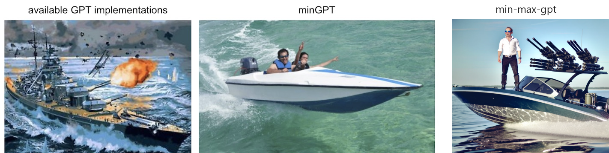

# min-max-gpt : minGPT that scales

So you've looked at [minGPT](https://github.com/karpathy/minGPT). Now its time to scale.

<p align="center">
  
</p>


This codebase provides..
* muP-initialization & learning rate settings, with tweakable gpt code.
* mixed precision trianing, FSDP with deepspeed zero-3
* ZERO-HUGGINGFACE : If you are interested in not-relying-on-huggingface for training, this is it. This doesn't use accelerate, transformer, etc, so you have maximal control. (still uses `default_data_collator` and `get_scheduler`, but its really easy to get rid of)
* Good Deepspeed codebase.

---
# Usage

Single Node training:


```bash
git clone https://github.com/cloneofsimo/min-max-gpt
cd min-max-gpt
pip install -r requirements.txt
export WORLD_SIZE=$(nvidia-smi -L | wc -l)
deepspeed --num_gpus $WORLD_SIZE run_trainer.py --lr 1e-4 --width 32 --run_name "test"
```

Multi-node training:

Coming up soon.

---

## Current Test Status:

* Tested on 8x 80GB A100 GPUs, can train 20B models.


---

todo : 
- [ ] multi-node training
- [ ] mu-scaling plot
- [ ] test on llama 